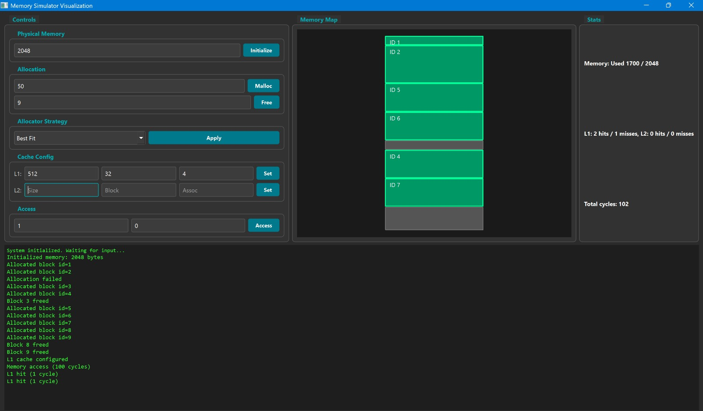

# 🧠 Memory Simulator Visualization

A GUI-based memory management simulator that helps visualize and understand physical memory allocation, cache behavior, and memory access patterns.

Built using **C++ and Qt**, this project is intended for educational purposes, especially for Operating Systems and Computer Architecture courses.

---

## 📌 Overview

This application simulates how an operating system manages physical memory and CPU caches. Instead of working purely from a terminal, users can interact with the system through a graphical interface and see the memory layout update in real time.

The simulator focuses on:
- Physical memory management
- Cache hierarchy behavior
- Allocation strategies and fragmentation
- Access cost and cache efficiency

---

## ✨ Features

### 🧠 Physical Memory Simulation
- Initialize physical memory with a configurable size
- Dynamic memory allocation and deallocation
- Allocation strategies:
  - First Fit
  - Best Fit
  - Worst Fit
- Automatic coalescing of free blocks

### 🧩 Cache Simulation
- Configurable L1 and L2 caches
- Adjustable cache size, block size, and associativity
- FIFO replacement policy
- Tracks cache hits, misses, and hit ratios
- Simulates miss penalties and total access cycles

### 📊 Visualization
- Real-time memory map showing allocated and free regions
- Each memory block is displayed with a border and ID
- Automatic updates after every operation

### 🖥️ Interactive GUI
- Initialize memory
- Allocate and free memory
- Configure allocator strategy
- Configure cache parameters
- Access memory blocks by ID and offset
- Reset simulation

### 📈 Statistics
- Total and used memory tracking
- Cache hits and misses per level
- Hit ratios
- Total memory access cycles

---

## 🛠️ Tech Stack

- Language: C++17  
- GUI Framework: Qt 6 (Widgets)  
- Build System: CMake  
- Compiler: MinGW (Windows)  
- Platform: Windows Desktop  

---

## 🚀 Getting Started

### 🔹Run Prebuilt Application

1. Download the latest release from the GitHub Releases page.
2. Extract the ZIP file.
3. Run `memory-simulator-gui.exe`.

